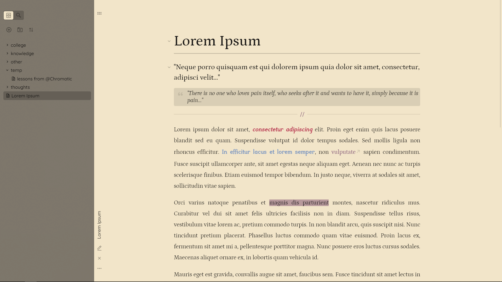

# obsidian-cidreira-coast-theme

## THIS THEME IS LIGHT-MODE ONLY!

### to-do
- [ ] add Style Settings support
- [ ] fix footnotes bug (consult @foreveryone)

### this theme is 99% derived from [California Coast Theme](https://github.com/mgmeyers/obsidian-california-coast-theme), which is derived from [Minimal Theme](https://github.com/kepano/obsidian-minimal).

It looks the best with almost everything from Hider turned on, and with the "translucent background" option on as well.

 

***highly*** recommended plugins| fonts used |
:--------------------------------:|:--------:|
[Hider](https://github.com/kepano/obsidian-hider)| [Quicksand](https://fonts.google.com/specimen/Quicksand) (UI and menus) |
[Sliding Panes (Andy Matuschak Mode)](https://github.com/deathau/sliding-panes-obsidian)| [Petrona](https://fonts.google.com/specimen/Petrona), [Sylexiad Serif Thin](https://www.sylexiad.com/fonts/sylexiad)  (body, italics and bold) |
[Buttons](https://github.com/shabegom/buttons) join the cult| [JetBrains Mono](https://fonts.google.com/specimen/JetBrains+Mono) (code blocks) |

 

